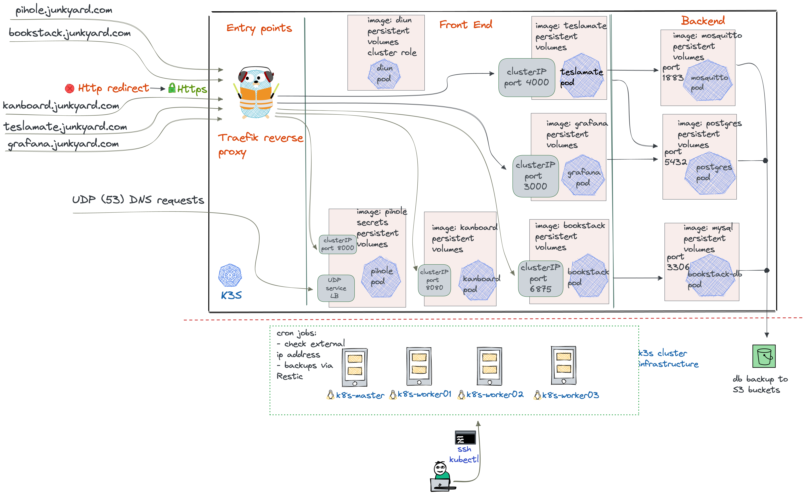

# k8s-home-lab-deployment
This has the High level diagram of my Home-Lab 

## Intro
Currently, my Home-Lab has the has services such as [Teslamate](https://github.com/adriankumpf/teslamate), [Grafana](https://grafana.com/), [Pi-Hole](https://pi-hole.net/), [Bookstack](https://github.com/BookStackApp/BookStack), Checking External IP address, [Diun](https://crazymax.dev/diun/) and [kanboard](https://kanboard.org/) behind [Traefik](https://doc.traefik.io/traefik/getting-started/quick-start/) reverse proxy. The back up of important data (Teslamate and Bookstack) to AWS S3 bucket is performed using [Restic](https://restic.net/).

*Created using [Excalidraw](https://excalidraw.com/)*
